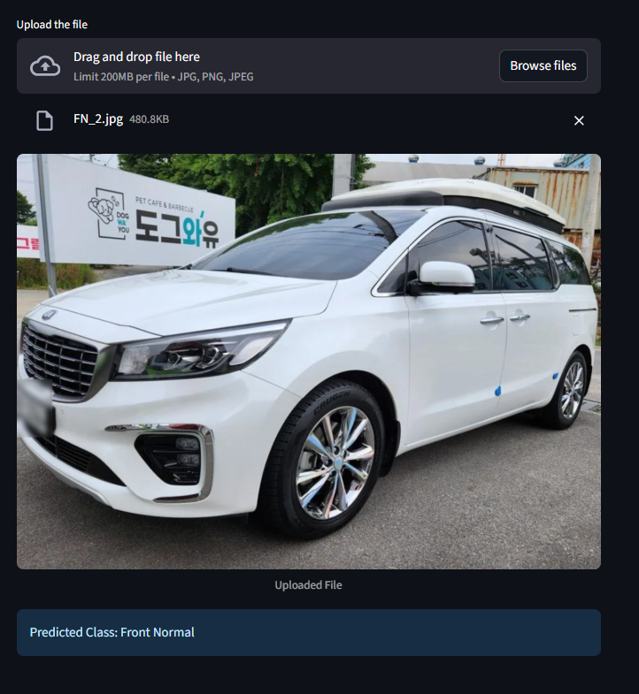

🚗 Car Damage Classifier

A deep learning project that classifies car images into damage categories using a fine-tuned ResNet50 model.
Built with PyTorch and deployed as an interactive web app using Streamlit.

📌 Problem Statement

Assessing vehicle damage is often a time-consuming process for insurance companies, car rentals, and service centers.
This project automates the process by detecting and classifying damage severity from uploaded car images.

⚙️ Tech Stack

Python 3.9+

PyTorch – for model training & inference

Streamlit – for interactive web app

Torchvision – pretrained ResNet50 model

Pillow, NumPy – for image preprocessing

🧠 Model Overview

Base Model: ResNet50 pretrained on ImageNet

Fine-Tuned: Trained on car damage dataset

Saved Model: stored as saved_model.pth

Classes (example – update with your dataset):

- Front Normal

- Rear Normal

- Front Breakage

- Front Crushed

- Rear Breakage

- Rear Crushed

🚀 Features

Upload an image of a car and get damage prediction instantly

📸 Demo
Web App Screenshot

🛠️ Installation & Usage

1️⃣ Clone the repo

git clone https://github.com/shaikshan/CarDamageDetection.git

2️⃣ Install dependencies

pip install -r requirements.txt

3️⃣ Run the Streamlit app

streamlit run app.py

4️⃣ Upload a car image and view predictions! 🎉

📂 Project Structure
streamlit_app/
│── app.py               # Streamlit app entry point
│── model_helper.py      # Model loading & prediction utilities
│── requirements.txt     # Dependencies
│── model/
│   └── saved_model.pth  # Trained ResNet50 model

📊 Results

Model Accuracy: XX% (replace with your results)

Example predictions: (add sample input/output images here)

🌐 Deployment

You can deploy this app on:

Streamlit Cloud

Heroku / AWS / GCP

🔮 Future Improvements

🔍 Add damage localization (bounding boxes with YOLO/Faster-RCNN)

📱 Mobile integration

🧾 API for insurance claim automation

📜 License

This project is licensed under the MIT License.

✨ Developed with ❤️ using ResNet50, PyTorch & Streamlit